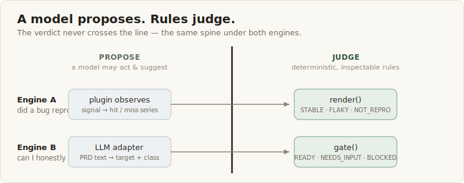
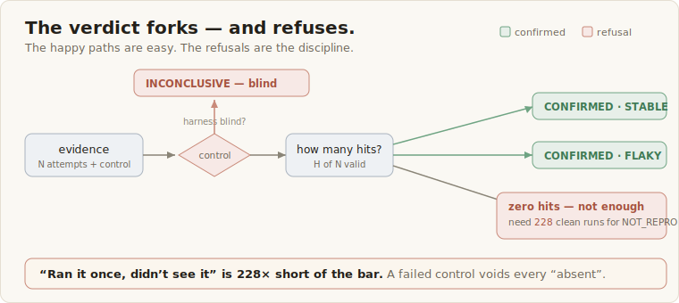
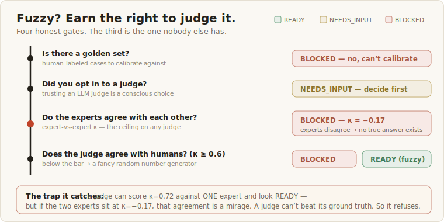

# Oraculum

# Honest measurement for AI-native building.

**A verdict discipline for everything you build with AI — it tells you where you
can honestly measure, and refuses to fake it where you can't. Across all three
loops.**

AI made *building* fast. So every loop of development now races toward its success
signal faster than ever — and racing toward a *fake* signal is just being wrong
faster, and more confidently. The scarce thing is no longer build speed; it's
**whether the signal each loop is chasing is honest.** Oraculum is that layer of
honesty.

Andrew Ng frames building as three nested loops, each with a different source of
truth: the **agentic coding loop** (the agent, judged by your *spec*), the
**developer feedback loop** (you, judged by your *intent*), and the **external
feedback loop** — product-market fit — (the *world*, judged by real users). No
single eval works across all three; the sources of truth are too different. What
carries across is one **discipline**: *judge honestly where you can; where you
can't, say so plainly and hand the bet back to you.* Checkable → judge.
Fuzzy-without-ground-truth → refuse. That same rule runs in every loop.

- **Agentic coding loop:** `oraculum check <prd>` gates it — before an agent
  iterates, confirm which targets can be honestly evaluated (blocked ones fail
  CI); `oraculum scaffold` then emits the self-guarding verifier the agent tests
  against.
- **Developer feedback loop:** the readiness report *is* your steering signal —
  it names which parts of the spec are eval-ready and which are your to-do.
- **Product-market-fit loop:** the discipline holds, the boundary is the point —
  we force your PMF hypothesis to be falsifiable and read noisy market signal with
  statistical power, but we **do not tell you what your PMF is**. That truth lives
  in the future and in your users; a tool that pretends to answer it would be the
  exact theater we exist to kill.

Every decision is a **machine-checkable verdict** with *no agent self-assessment*
anywhere in it. *(Today the built engines cover loops 1–2 end-to-end; the Loop-3
hypothesis-gate and signal-oracle are the same two engines pointed at a new source
of truth — on the roadmap, not yet shipped.)*

Its Phase-1 core is the **Verdict Engine** (`verdict_engine.py`) — a
*probabilistic test oracle* that judges whether a bug reproduced:
**Confirmed Repro (Stable / Flaky) · Confirmed Not Reproducible · Inconclusive**.

Traditional regression tests bundle two things: *running* the case and
*asserting* whether it passed. In LLM / agent systems the assert half collapses:
"correct" is probabilistic, intermittent, and observation itself can fail.
The Verdict Engine's `render()` is that assert half, rebuilt for the
probabilistic world.

## Quickstart

```
git clone https://github.com/next7years/oraculum && cd oraculum && python run_demo.py
```

No dependencies (Python 3.9+, stdlib only). You'll see: one case end-to-end
through a swappable oracle, the full decision tree over golden fixtures, the
self-eval regression guard, and what the thresholds actually cost you.

Then try the two engines: `python run_engine_b_demo.py` (the interrogation gate)
and `python run_fuzzy_demo.py` (judge calibration on a recruiting call).

## Two ways to use it

Same tool, same soul (*the judgment is always yours, never the model's*) — two ways
to reach it:

- **Agent-driven (easiest).** In a Claude Code / Codex session, hand your agent a
  repo + a PRD and say *"use Oraculum to build my eval — read AGENTS.md."* It runs
  the check, reads your code, generates the plugin, and **stops to ask you the
  judgment calls** (what counts as a `hit`, the thresholds). You never touch a file;
  you just answer the questions. See [`AGENTS.md`](AGENTS.md).
- **Library / CLI (for keeps).** Integrate Oraculum into your own repo and CI: run
  `oraculum check` as a merge gate, keep the generated harness alongside your code,
  own the plugins. Best when the eval should live in your project long-term. See
  [`TUTORIAL.md`](TUTORIAL.md).

The difference is only *how you express the judgment* — in a conversation (agent) or
in code (library). Neither one lets the model decide for you.

## The one line that matters

```python
render(EvidenceBundle, Thresholds) -> VerdictResult
```

Pure, deterministic, and domain-agnostic. Judgment lives in inspectable,
versioned rules — not in a model's whim.

## How it works (at a glance)

**One spine, two engines — a model proposes, deterministic rules judge.** The
verdict never lives in the model.



**The verdict forks — and the refusals are the discipline.** A failed positive
control voids every "absent"; "not reproducible" is only earned after enough clean
runs to be statistically sure (228, at `p_floor=0.02`).



**For fuzzy targets, trust is earned, not assumed.** An LLM judge only counts once
it's calibrated against humans (Cohen's κ) — and it can never be more trustworthy
than the humans themselves. If the experts disagree, there's no ground truth to
calibrate against, so it refuses.



## Spine vs plugins

- **Spine (reusable, app-agnostic):** `verdict_engine.py` — the contracts,
  `render()`, and the stress-run / statistical-power math. Nothing here is
  domain-specific.
- **Plugin (swap per app):** `example_exception_oracle.py` — maps raw captured
  signals to a per-attempt hit. Swap it for your domain's signal without
  touching the spine. Plugins observe; the spine judges.

## SignalSources & the one number you still set

The spine is fed by **plugins**, one per signal. Two ship today, to prove the
interface is domain-agnostic — **the same `render()` judges both**:

- `example_exception_oracle.py` — plugin #1 (toy): an exception-type signal.
- `recall_oracle.py` — plugin #2: a **recruiting recall** signal (does a
  known-good candidate fall out of the top-k?), driven by a seeded reproducible
  jitter sim (`recall_runner.py`) over a static data snapshot.

To wire your own domain, add a plugin that maps your raw signal (a VR frame-state
probe, a log regex, an HTTP status, a metric threshold) to a per-attempt `hit`.
The spine does not change.

**You don't have to hand-write that plugin.** Point your coding agent (Claude Code,
Codex, …) at this repo and say *"use Oraculum to build an eval for my feature — read
AGENTS.md"*. [`AGENTS.md`](AGENTS.md) tells the agent how to generate the plugin and
glue in your function — while stopping to ask *you* the judgment calls (what counts as
a `hit`, the thresholds). The agent does the boilerplate; the judgment stays yours.

**One number is still yours to set — `p_floor`** — the smallest flaky rate you
insist on ruling out. It sets how many clean attempts a "Not Reproducible"
verdict requires: `S >= ln(alpha) / ln(1 - p_floor)`. At `p_floor=0.02,
alpha=0.01` that is **228 clean attempts** — which is exactly why "ran it once,
didn't see it" is not a valid verdict. Tune it to your system's flaky magnitude.

## Why the golden fixtures matter

`golden_fixtures.py` holds hand-labeled cases with known verdicts. The judge
itself can regress; running `render(fixture) == expected` is the judge's own
regression guard. The judge sits above the pipeline; this set sits above the
judge.

## Engine B in your dev flow (the CI gate)

`cli.py` wraps the interrogation gate as a check you can drop into CI, exactly the
way a linter or type-checker gates a merge:

```
oraculum check path/to/prd.md
```

It reads the PRD, runs Engine B (the LLM adapter proposes targets, the
deterministic gate judges them), prints the readiness report, and **exits
non-zero if any target is not eval-ready** — so a blocked eval-readiness fails the
build:

| exit | meaning |
|---|---|
| `0` | all targets READY — an honest eval is possible; a scaffold may follow |
| `1` | some NEEDS_INPUT, none BLOCKED — solvable, a prerequisite is missing |
| `2` | at least one BLOCKED — hard fail: the eval would be theater |

The adapter needs a model to extract targets from free text; set
`ORACULUM_ANTHROPIC_API_KEY` (or `CGL_`/`ANTHROPIC_API_KEY`, or `--api-key`).
With no key the CLI refuses loudly rather than emit an empty "all clear" report.

**Wire it into CI (this is the same Library/CLI mode, just on every PR).** A ready-to-
copy GitHub Actions workflow lives at
[`.github/workflows/oraculum.yml.example`](.github/workflows/oraculum.yml.example) —
copy it to `.github/workflows/oraculum.yml`, point `PRD_PATH` at your spec, and add
an `ORACULUM_ANTHROPIC_API_KEY` repo secret. A BLOCKED target fails the job, so a
"your new AI feature has no honest oracle" merge gets stopped — like a linter, but
for eval honesty. (Honest caveat: the check makes real API calls, so it needs that
key; there's no free "all clear".)

Once a target is READY, close the loop back to Engine A:

```
oraculum scaffold path/to/prd.md --out oraculum_harness
```

This emits a Verdict-Engine harness stub — a SymptomSpec + plugin skeleton
(`*_oracle.py`), a golden-fixture stub (`*_fixtures.py`), and an attempt-loop +
positive-control skeleton (`*_runner.py`) — wired against the Phase-1 contracts in
`verdict_engine.py`, ready for you to fill in your real signal source. **Only
READY targets are scaffolded**; blocked ones are reported and withheld — refusing
to scaffold an eval that would be theater is the whole point.

## Intellectual lineage

This is **not** a new theory. It **synthesizes test-oracle theory + flaky-test
quantification + LLM-as-judge calibration into a verdict discipline for agent
systems** — a rigorous assembly of proven parts, which is *more* credible than
claiming invention. All three literatures rest on one structural claim:

> **You cannot trust an oracle you have not validated; and validation is
> statistical, not self-asserted.**

The Verdict Engine is that single claim, applied to agent systems. The three
pillars:

- **Test-oracle problem** — Barr, Harman, McMinn, Shahbaz, Yoo, *"The Oracle
  Problem in Software Testing,"* IEEE TSE 41(5), 2015. That survey formally
  defines a **probabilistic test oracle** with soundness/completeness — which is
  exactly what `render()` is. Not a coined term; a defined one.
- **Flaky-test quantification** — Micco (Google, 2016) + Luo et al. (FSE 2014) +
  the FlakeRate line. Grounds our stress-run acceptance and the power bar that
  makes "ran it once, didn't see it" statistically invalid.
- **LLM-as-judge calibration** — Gu et al. survey (2024) + Zheng et al.
  (NeurIPS 2023). Grounds "calibrate the judge against a golden set before you
  trust it," and Cohen's κ as the judge's own regression signal.

### What's novel here

The synthesis is the contribution; three places we go past the sources:

1. **Probabilistic oracle over a *random* SUT.** Classic oracle theory assumes a
   deterministic system-under-test with a hard-to-write oracle. We apply it where
   the SUT itself is stochastic (agents/LLMs) — the verdict must tolerate *both*
   the system's randomness *and* observation failure.
2. **Rerun heuristics → a statistical acceptance criterion.** "Rerun 3×" is
   blind to low-rate flakes. We replace it with an explicit power bar for
   NOT_REPRO (`S ≥ ln(α)/ln(1−p_floor)`) and a fix-stage detection bar for FLAKY.
3. **The judge is itself under eval.** The golden fixtures are the judge's own
   Level-2 regression seed — an oracle sits above the oracle, so it can't quietly
   rot. (And even the ground truth deserves audit — the anti-Goodhart caveat:
   human-labeled golden sets carry bias too, so they need rotation.)

## Repository map

```
.
├── README.md                     # you are here — orientation + quickstart
├── verdict_engine.py             # the spine: contracts + render() + the math  [Phase 1, built]
├── example_exception_oracle.py   # domain plugin #1 (toy) — an exception-type signal
├── recall_oracle.py              # domain plugin #2 — a recruiting recall signal (proves the
│                                 #   plugin interface is domain-agnostic: two SignalSources, one spine)
├── recall_runner.py              # seeded, reproducible jitter sim that drives the recall plugin
│                                 #   (NOT a real LLM — verdicts must be reproducible; see below)
├── recall_data/                  # static CGL snapshot (candidates + golden labels), copied so the
│                                 #   example is self-contained; not a live CGL connection
├── golden_fixtures.py            # Engine A's eval seed (now incl. recall STABLE/FLAKY/NOT_REPRO)
├── run_demo.py                   # `python run_demo.py` — Engine A end-to-end
│
│  # Engine B (interrogation gate): PRD text -> Eval Readiness Report [Phase 2]
├── oracle_taxonomy.py            # the fixed 5-class oracle taxonomy + Target contract
├── readiness_gate.py             # the deterministic gate (the moat): Target -> READY/NEEDS_INPUT/BLOCKED
├── report.py                     # Eval Readiness Report renderer (+ "scaffold withheld")
├── llm_adapter.py                # the thin LLM adapter — PROPOSES targets; anthropic SDK is optional/lazy
├── engine_b.py                   # end-to-end: PRD text -> propose -> gate -> report
├── golden_prds.py                # Engine B's own eval seed (gate regression guard)
├── run_engine_b_demo.py          # `python run_engine_b_demo.py` — Engine B end-to-end
├── cli.py                        # `oraculum check <prd>` (CI-gate) + `oraculum scaffold <prd>`
├── scaffold.py                   # emit a harness stub for a READY target (closes loop to Engine A)
└── TUTORIAL.md                   # hands-on guide: use it on your own product
```

## Reading order (for contributors / Claude Code)

Start here, in order:

1. **`README.md`** — orientation, then run `python run_demo.py`.
2. **`TUTORIAL.md`** — **if you want to USE this on your own product, start here.**
   Hands-on: the check → scaffold → fill-in → verdict loop, with a real example.
3. **The code**, in this order: `verdict_engine.py` (the spine — the full decision
   tree is documented inline) → `example_exception_oracle.py` (plugin #1, toy) →
   `recall_oracle.py` + `recall_runner.py` (plugin #2, a real recruiting-recall
   signal — the proof the interface is domain-agnostic) → `golden_fixtures.py` →
   `readiness_gate.py` (Engine B's gate) → `cli.py` → `scaffold.py`.
